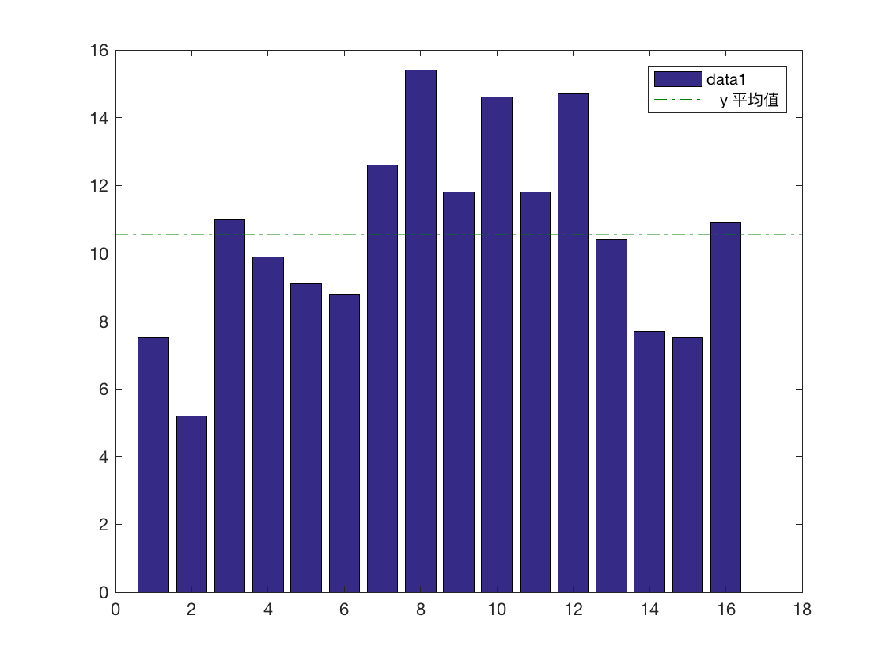
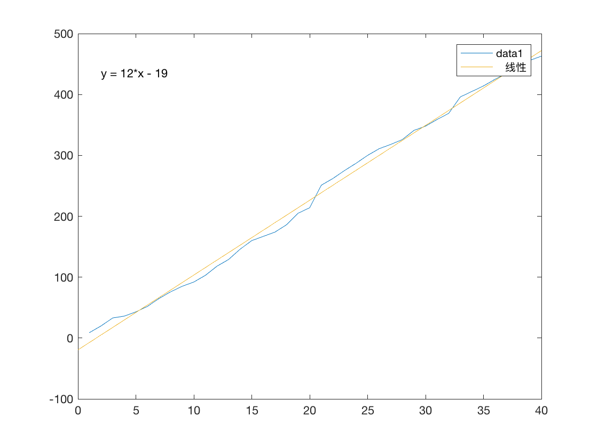
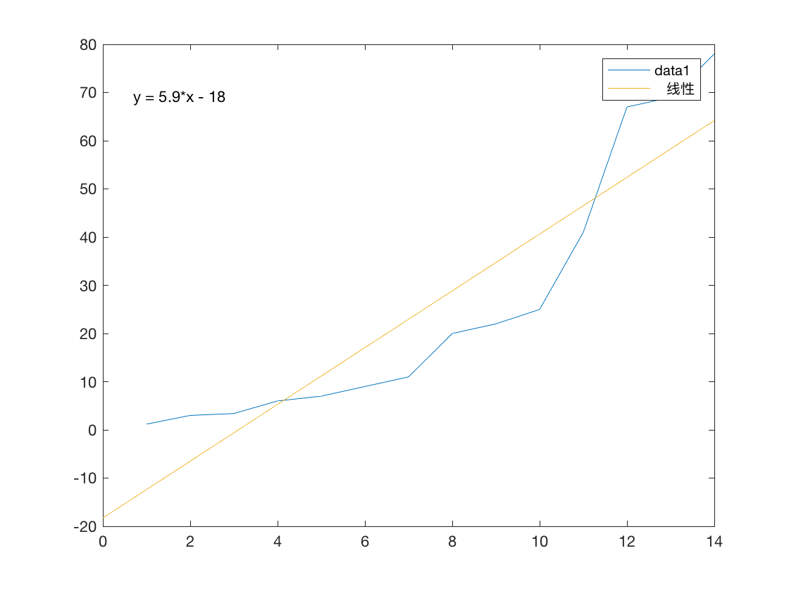
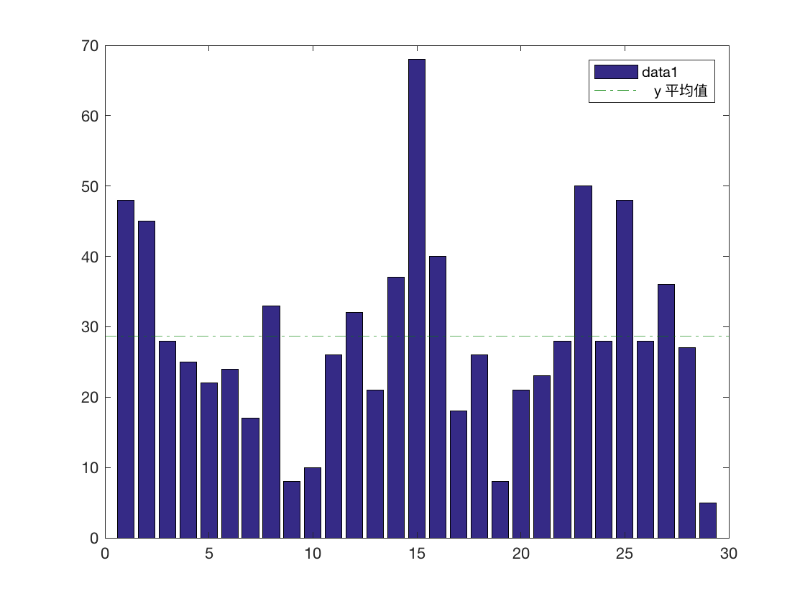
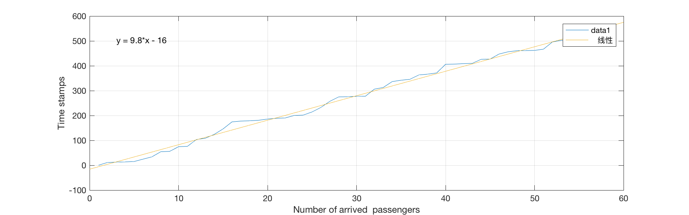
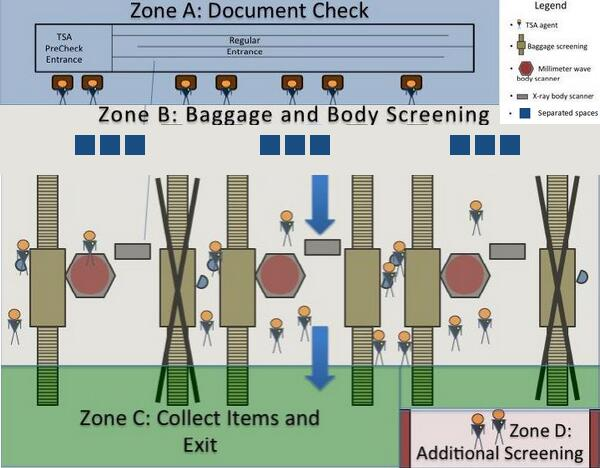

### 控制页

### Summary
。。。 

。。。。 

。。。。。 

。。。。。。

--- 

# Increase the throughput and decrease the variance of waiting time at airport 

Author : Meng ZhengYuan , Gao ChunYang , Wang YunHan

Adviser : Xu ZhiGuo

## Introduction

This paper talks about how we can optimize the throughput of the security checkpoint decrease 
the variance of time when people wait in line for safety check before they are allowed to board the plane.

To optimize the throughput of the airport security checkpoint we have to decrease the average time 
each passenger used to get through the TSA security checkpoint.At present people sometimes need to 
wait for a long time to get themselves and their packages checked by the officers.This is what often 
happens in some big airports of America.There are reasons for this situation,but there 
responsibilities for us to distinguish this long waiting and optimize the user experience.

The key to decrease the variance of waiting time is to avoid cluster phenomenon of the the passenger
arrive at the airport correspond to the time of plane to take off.We will get a stable waiting time
in the line in front of the security checkpoint if we can achieve a method to balance the time
passengers get to the start of the boarding check ( zone A in this problem ).

At first we analysed the problem of the current situation ,including the factor that caused the
bottleneck of the throughput and 

## 1. What influence the throughput and the variance of waiting time

### 1.1 乘客到达机场的时间
### 1.2 The time passengers arrive at the airport

从相关的数据来看，乘客到达安检区的分布大致是线性的，根据相应的曲线拟合，大概每十秒会有一位乘客到达安检口
开始安检。乘客到达安检口的速度直接影响了安检通过的流量和拥挤程度，如何较好的均衡乘客到达的速度，避开集群
现象对于减少乘客的排队时间至关重要。

From the correlational data set,we find that the speed passengers arriving at the security 
check point is linear and homogeneous to the time.Using the curve fitting we conclude that
a passenger will arrive at the check point and start to line every 10 seconds approximately.
The speed passengers get to the check point directly influence how many people pass the 
security check and board and how crowded the area is in a nearly period.It is significant to 
balance the passengers arriving at security check and avoid cluster phenomenon if we waht to 
decrease the time every passengers waits to get themself and his carriage checked and optimize
the user experience.

### 1.2 每一位乘客通过安检所花费的时间

乘客从开始检查登机牌等证件开始，知道通过安检拿走自己的行李结束，这段时间与机场的安检策略有着非常直接的
关联。从安全的角度考虑，安检越详细，安全性就越高，但是过分详细的安检可能会大幅度延长乘客花费在安检上
的时间，而且由于文化的差异，有些安检条目可能会对用户的隐私和习惯带来不便

### 1.3 特殊情况的乘客所占的比例对整体的影响，以及相应的政策和规定对于异常乘客比例的影响

安检策略的严格程度从一定程度上决定了安检异常乘客所占的比率，相对宽松的安检可能会在一定程度上降低安检
异常的乘客所占的比率，而过分严格的安检会大幅度增加案件异常的乘客所占的比率，从而增加处理这些乘客所花
费的时间和人力物力，造成安检队伍的堵塞，增加排队乘客的等待时间，对用户的体验造成不好的影响

### 1.4 预检查乘客所占的比例对于流量的影响，以及通过降低预检查乘客的价格带来的预检查乘客的比例的增加而需要增加更多的预检查通道所带来的成本和收益问题

预检查通过提前的检查缩减了安检时的检查时间，对于提高用户的体验有着较为良好的效应。但是预检查用户所
占有的比率的增加对于整体的情况的影响是多个方面的，包括好的方面和坏的方面。

从好的方面来说，预检查大幅度减少了用户花在安检上的时间，减少了用户在安检时的条目，用户不用将相关的
物品从包里面拿出来，经过检查之后再返回包里。而且，用户也不用再将外衣，鞋子，皮带等相关物品脱下接受
人体扫描。这不管是对于用户的隐私和生活习惯，还是用户的乘机体验都有非常好的影响。同时，对于机场来说，
安检时间的减少意味着一条安检通道可以在相同的时间内通过更多的乘客，一方面可以增加乘客的流量,另一方面
意味着机场的安检部门可以用更少的安检队列完成安检的任务，降低了安检的成本。

从坏的方面说，预检查需要乘客提前付出一定的代价，这对于不同的乘客可能造成不公平的心理因素影响，并且对
于那些乘坐飞机次数相对较少的乘客来说，办理预检查可能对于这些人不具有什么吸引力，从而不利于预检查乘客
所占比率的提高，我们将在第三部分提出针对这个问题的解决方案。另一方面，对于机场来说，预检查的乘客的增
多意味着机场需要建设更多的预检查的通道，付出更多的人力和物力，增加了机场的安检成本

## 2. What is bottleneck of the throughput

### 2.1 The throughput is influenced by average check time

It is easy to know that more time a passenger uses to pass through the check , 
lower the throughput will be.So, throughput is negative to the average check time of each
passenger.

We use ***Y*** to represent the throughput and ***T*** to represent the average check time of 
each passenger.Then we get the expression below:

$$
Y=\cfrac{1}{T}
$$

If we want to increase the throughput(***Y***),we must decrease the average check time(***C***)

### 2.2 What is influencing the average check time

As is described in the question D,we know that a passenger has to pass zone A , B , C,sometimes
 D to get through the checkpoint and board the plane.The process of security check is a serial of
check items and each passenger has to finish each single check.So，how long a passenger need to
get through the whole security check is the sum of the time each single check consumes.

We use ***A*** to represent the average time cost by zone A , ***B*** to represent the time 
cost of zone B , ***C*** to represent the time cost of zone C , ***D*** to represent the time 
cost of zone D.In this case we can get the expression below: 

$$
T = A + B + C + D
$$

If we want to calculate the average time cost of each passenger ,we have to calculate the time
cost of each step (include A, B, C, D) .

### 2.3 How we can calculate the average check time

In the last section,we concluded that we have to calculate the time cost of each step of the 
security check.Now,we calculate each of them.

#### 2.3.1 How we calculate time cost of zone A

From the data given in excel,we use average value to determine the time each passenger
cost to pass zone A

Figure 2.1 time cost of zone A

We make a bar graph as shown above（Figure 2.1).From this graph and the average value show by a vertical line 
on the graph, we can know that the time cost of zone A is about 10 seconds in average.So, we use 
10 seconds as the average of the time cost as a passenger pass through the check of zone A and 
go on for the check of zone B.That means:

$$
A = 10
$$

#### 2.3.2 How we calculate time cost of zone B

The time cost of zone B can be calculated from three part(Miliwave,X-Ray,and belt),
we use ***B1*** , ***B2*** , ***B3*** to represent the 3 parts and calculate them separately 
to get the ultimate result--time cost of zone B.

From the data of milimeter wave scan time column,we get the graph below(Figure 2.2):

Figure 2.2 time cost of milimeter wave scan

Using the curve fitting we found that the linear model is simple and fits good with the shape
of the data curve,so we use the function ***y=12x-19*** to describe the time cost of milimeter
wave scan time.Now,we get ***B1*** :

$$
B1 = 12
$$

From the data of X-Ray scan time column,we get Figure 2.3 as shown below:

Figure 2.3 time cost of X-Ray scan

From the result of curve fitting we know the time cost of X-Ray cost of passengers can be
roughly decribed by the function ***y = 5.9x - 18***,so we just assume :
 
 $$
 B2 = 6
 $$
 
From the data of column H ( Time to get scanned property ),we can get the graph 
below(Figure 2.4) ：

Figure 2.4 time cost of X-Ray scan

We can know from Figure 2.4 that the average of the time each passenger cost to get the 
scanned property isabout 29 seconds.Considering that on a long time range the amount of 
passengers is relatively large and it is suitable to use this value (29s) as the time cost 
of package scan checking on the transport belt.That is :

$$
B3 = 29
$$

Now we have all the three part of time （***B1*** , ***B2*** , ***B3*** ) in zone B,but how 
long a passenger cost is not the sum of the three part.Because when a passenger take out his
computer and other electronic devices from his packages and pockets and other items that 
has to be put in a bin and get checked.Then he can put these things on the belt and step
forward to get himself checked by a miliwave check or X-Ray check.In other words,the check
of items and person is parallel and the time cost by this parallel procedure should be the
longest time of the three parts of time.

From the result above,we can calculate ***B*** from ***B1*** , ***B2*** , ***B3***:

$$
B = max\{ B1 , B2 , B3 \}
$$

And the three  part of time we have got above:

$$
\begin{cases}
B1 = 12 \\
B2 = 6 \\
B3 = 29
\end{cases}
$$

So:

$$
B = 29
$$

The conclusion above is based on the premise that every passenger passes the security check
and have no item that might cause an argument with the officers.If a passenger bring some 
thing considered dangerous to be with the passenger when boarding by the officer,then the 
time cost will increase a lot and might block the whole line.In this case,the passenger 
can be moved to zone D and get more check by the officers at zone D.Because the ratio of 
'problem' passengers in all the passengers is small,so we will talk about this problem 
in chapter 2.4

### 2.3 How we calculate the time cost of zone C

What the passengers do at zone C is simply collect their items and go boarding the plane.
This is very easy and fast process so we just ignore this part of time:

$$
C = 0
$$

### 2.4 How we calculate the time of zone D

Only in the situation when a passenger brings something considered very hard to judge
or just cannot be judged by the officers at zone C or something that causes an argument
between the checkers and the passenger that a passenger will go to zone D for further 
check.The average time a passenger cost in zone D( not everyone cost time in zone D ) is
determined by the ratio of passenger that must be checked at zone D,we use 
***PD*** to represent this ratio,and we use ***TD*** to 
represent the time one passenger stays at zone D and get checked by the officer.So
the average time each passenger cost in zone D ( considering all the passengers, include 
those who do not need to go to zone D for further check ) is 
***TD*** x ***PD*** ,that means :

$$
D = P_D \times T_D
$$

The value of D is relational to ***TD*** and ***PD***,but there are only 
a very small part of passenger need to be checked at zone D,so D is so small that it will 
not cause big influence to the average time of the whole security check.In this situation,
we just consider D a constant determined by the security policy of the TSA.

To be convenience for our calculation,we temperately make an assumption :

$$
D = 0
$$

### 2.5 The bottlenecks of the security check procedure is zone B

From the conclusion above:

$$
T = A + B + C + D
$$

and

$$
\begin{cases}
A = 10 \\
B = max\{ B1 , B2 , B3 \} = 29 \\
C = 0 \\
D = P_D \times T_D
\end{cases}
$$

The result is :

$$
T = A + B
$$

We can get the percentage of time each part(A , B , C and D) relative to the whole time cost (***T***) 
of the security check procedure :

$$
\begin{cases}
R_A = \frac{A}{A+B} \\
R_B = \frac{B}{A+B}
\end{cases}
$$

assign the relative data to ***A*** and ***B*** we can get :

$$
\begin{cases}
R_A = 25.64 \% \\
R_B = 74.36 \% \\
R_C = 0 \% \\
R_D = 0 \%
\end{cases}
$$

Conclusion is drawn from the result shown above that the time a passenger cost has so high a ratio of 
the whole time used in security check and the time cost in zone A and zone B has so big a gap that
the passing ratio of zone A and zone B cannot reach the state of balance.We can also say that every 
period of time zone A will get blocked by the low speed of zone B.All in one,costing too long in zone 
B is the bottleneck of the security check throughput.

### 2.1 乘客到达机场的时间的分布

乘客到达机场开始安检的时间设为T，T是一组相应的离散的时间点，代表了乘客到达安检的时间，这个T应该是关于
到达的人数(设为n)的一个函数

Figure 1.到达时间的函数拟合

经过数据作图和函数拟合(Figure 1)，我们发现线性模型可以较好的描述这种情况

$$
T=an+b;
$$  

其中的a，b是相应的系数，根据数据作分析，可以得出

$$
\begin{cases}
a=  \\
b=  
\end{cases}
$$  

这个模型是后面的许多公式和结论的基础

### 2.2 人均安检时间的分布（包括异常乘客说造成的影响）

### 2.3 预检查带来的成本和收益问题，以及对于减少人均排队时间的影响

### 2.4 增加一个安检通道所能带来的排队时间收益，人流量收益以及所需的成本

## 3. 解决方案

### 3.1 通过算法进行安检时间的调度

相对于较为随机和混乱的乘客自主选择排队时间和排队地点，集中式的的排队时间和地点调度能够大幅度提升排队的效率。
这是因为如果乘客按照没有任何调度的去排队，那么，就会随着航班起飞的时间出现一波一波的排队高峰期，大部分的乘客
把自己的时间浪费在由于队伍较长而造成的等待上。为了解决这个问题，必须有一种更为有效和方便的调度策略，让每个乘
客在最合适的时间去接受安检，尽量避免让乘客在很长的队伍里等候，这样，一方面可以提升用户体验，另一方面可以减小
机场的安检压力

为了对乘客进行调度，我们决定采用建议和强制性相结合的策略。这种策略一方面可以尽力减少乘客在安检的时候很容易
出现的集群现象，另一方面也可以让乘客更加自由的去安排自己的行程时间，并且不会由于安检而赶不上自己的飞机

我们的方案大致分为建议和强制性的两部分：

1. 基于对乘客的安检时间进行建议来进行安检时间的调度：
   
   在乘客订购机票的时候，给予乘客相关的信息，让乘客选择自己一个自己比较方便的时间段。我们预测到大部分乘客
   可能会选择比较靠近航班起飞时间的时间段，因此，在乘客选择时间段的时候，我们将这一时间段被乘客选择的次数
   提供给乘客，那么，乘客就有一定的可能放弃最靠近航班起飞时间的时间段，转而选择排队人数较少的时间段。对于
   每一个时间段，这一时间段被选择的次数越多，那么发生长时间等待的可能就越大,在乘客选择时间段的时候告知每个
   时间段的拥挤情况，乘客便会优先选择人数较少的时间段，从而做到乘客在时间上的均衡，避免出现集群现象
   
2. 基于强制性的安检时间范围的限制：
   
   为了避免一部分的乘客在航班起飞之前，提前太长的时间去进行安检，从而造成搭乘很快就要起飞的航班的乘客在安检
   的队列中等候，航空部门可以通过一定的强制性措施去限制乘客，不要让乘客提前太长的时间进行安检，把安检的机会
   留给当前最紧急的乘客，从而避免有的乘客因为安检而无法登机

### 3.2 通过动态的告知乘客排队等待时间，尽量均衡的进行乘客的调度

乘客到达机场后，会在飞机起飞之前办理登机牌，然后选择某个时间到达安检口进行安检，在乘客办好登机牌到开始
排队安检的这段时间内，如何避免乘客出现集群现象对于减少排队时间，提升用户的体验非常重要，为了做到这一点
我们建立了动态的队列模型，给出了当前安检队列的情况，并针对当前哪些已经办理了等级牌但还没有安检的乘客给出
相应的建议，建议乘客在系统调度的时间段内去进行安检，可以等待最少的时间。

### 3.3 为不遵守调度的少数人预留相应的空间

当调度系统给出了相应的调度建议之后，乘客可以选择接受系统给出的调度建议，也可以不接受而根据自己的情况去选择时间，
这对针对这种情况我们的解决办法是在调度系统在进行时间的调度时，大致估算这部分乘客（不接受系统给出的时间）的比率，
而为这些乘客预留一定的队列压力额度。

### 3.4 信用的等级激励策略

### 3.5 脱衣服缓冲区，缓冲队列

由于整个安检程序最消耗时间的部分是对乘客的行李，背包，衣物等进行检查，从数据中也可以看出（Figure ）这个
部分是整个系统的瓶颈所在，因此我们的解决方案打算通过对这部分的并行化来突破这个耗时的瓶颈。下图是我们的方案示
意图

Figure 1.Add items Preparation Areas To Each Path

在图中，我们通过增加同时开始准备对自己的行李物品进行类，脱掉衣服准备开始接受检查的人数，来避免时间耽误在等待
每位乘客准备好他们的行李，进行分类并脱掉衣服的过程上，即不要让整个队伍都等正在接受安检的那个人分类自己的物品，
脱掉相关的衣服等过程上。这样的话，即可在整个流程中大幅度削减乘客接受安检时花费在这个环节的时间，从而在整体上
加快了队伍的前进速度，让乘客的排队时间更短，用户体验更佳。

## 4. 未来展望

### 4.1 无感式（no-touch）安检流程

即时我们通过各种手段，包括乘客的调度，加快安检流程等，用来缩减乘客的排队时间，让一切更为的有序，减少混乱，
提升用户体验。但是，对于乘客来说，这些还是太过于复杂，我们小组受到亚马逊自动超市的启发，希望运用最近新出现的
技术，基于实时的计算和检测，为乘客创造0等待，无接触甚至无感应的安检登机体验。做到和自动超市一样的 no lines，no
checkout，just board and take off ！

让我们来描述一下这样的场景：一天，你打算从纽约乘飞机去硅谷参加一个商业活动，航班的时间是早上10点，你早上
八点起床，九点收拾好了你的行李从家里出发，九点40分到达机场，还有20分钟飞机就要起飞了，但是，没必要惊慌什么。
你从机场的正门走进去，这时，遍布机场的摄像头开始对你进行识别和跟踪，安装在地面上的传感器已经通过你的手机
帮你办好了等级牌，地面上嵌入的扫描设备已经在智能电脑的控制下对你的行李进行扫描，当你走到登机口时（wait，where
is the security check ?)，你会在工作人员的一声祝您旅途愉快中登上飞机，开始您的旅途。这可能听起来非常的
激动人心，但这并非是不可能的。

我们之所以设立安检，不仅是为了保护飞机的安全，更是为了其他乘客的安全着想。安全检查能够将各种危险的因素拒之门外
从而保证了飞行的安全。但是，它同时也对乘客的体验造成了不可忽视的影响。对乘客进行检查意味着一种不信任，会带给
乘客一种不舒服的感觉，如何将安检在用户不知不觉中完成，而又不降低安全系数，是一项艰巨而漫长的任务。所以，我们
来看先前场景中的安检是如何完成的。

在进入机场的时候，遍布机场的传感器（包括但不限于摄像头）会对每一位乘客进行全方位的跟踪和识别，并且在乘客在机场
走动的过程中，利用分布在机场各处的传感器来完成安检。对乘客的跟踪和识别需要非常先进的图像识别和深度学习等人工
智能技术，而利用乘客在地面上走动的时间来完成危险物品的检查也对检查设备提出了更高的要求。与此同时，自动化的
登机牌办理需要机场的管理设备通过传感器识别到用户的手机，并建立连接。这些都对技术和设备提出了很高的要求，但是
实现之后可以前所未有的提升用户的体验，同时极大的增加机场的运输能力。

虽然这是比较理想的方案，但是实现的难度较大，短期内无法做到或者很难，即使这些方案由于成本等因素未能在短期内
实施，但随着更多高新技术的普及，这些也许就会在不远的将来变成现实。

### 4.2 相对易于实现的改进方案
    
#### 4.2.1 能够加快包裹扫描的3D扫描仪

在当前情况下，乘客必须把一些特殊物品从行李箱或者包裹中取出并分类，然后接受检查，这是一个及其耗费时间的步骤，
而现在的市场上，已经有一些扫描仪能够在不用用户把物品拿出来即可进行检查，这样无疑会大幅度增加物品检查的速度，
减少用户的排队时间，而且能够有效的保护用户的隐私，对于提升用户体验大有好处

### 4.2 加快人体扫描检查的仪器

安检的时候需要将一些衣服，鞋子，腰带脱下接受检查对于用户来说是一件很麻烦的事情，而且这些过程对于安检的速度
造成了非常大的影响，同时也会影响用户的隐私，不利于用户体验，因此对人体的扫描设备进行改进和升级就很有必要，
如果乘客在接受安检的时候不再需要将衣服等物品脱下，那么将是一件非常有益的事情。

## 总结

## 参考文献

