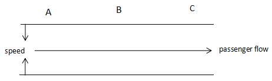
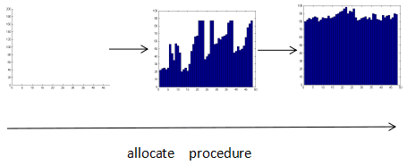

### 控制页

### Summary
。。。 

。。。。 

。。。。。 

。。。。。。

--- 

# Increase the throughput and decrease the variance of waiting time at airport 

Author : Meng ZhengYuan , Gao ChunYang , Wang YunHan

Adviser : Xu ZhiGuo

## Introduction

This paper talks about how we can optimize the throughput of the security checkpoint decrease 
the variance of time when people wait in line for safety check before they are allowed to board the plane.

To optimize the throughput of the airport security checkpoint we have to decrease the average time 
each passenger used to get through the TSA security checkpoint.At present people sometimes need to 
wait for a long time to get themselves and their packages checked by the officers.This is what often 
happens in some big airports of America.There are reasons for this situation,but there 
responsibilities for us to distinguish this long waiting and optimize the user experience.

The key to decrease the variance of waiting time is to avoid cluster phenomenon of the the passenger
arrive at the airport correspond to the time of plane to take off.We will get a stable waiting time
in the line in front of the security checkpoint if we can achieve a method to balance the time
passengers get to the start of the boarding check ( zone A in this problem ).

At first we analysed the problem of the current situation ,including the factor that caused the
bottleneck of the throughput and big variance of waiting time in the line.Then we build a model to 
calculate the average time cost of the passengers when they get through the security checkpoint based 
on these factors.We also developed a algorithm of pre-allocate time slice to decrease the variance 
of the waiting time.At last we give some advice and imaginations that might greatly optimize the user 
experience but is based on some new technology and more expense.

## review of the problem

For the reason of safety, American airports are using a very complicated and time-consuming methods 
at the security checkpoints.This action benefits the safety,however,on the other side,it not only
limits the throughput of the airport to a low level,but also slow down 
the speed passengers pass the boarding check and take off。What's worse,it even leave some people 
delayed of their flight.It is very necessary to put forward a solution for these problems.

## 1. What influence the throughput and the variance of waiting time

### 1.1 The time distribution of passengers arriving at the airport

From the correlational data set,we find that the speed passengers arriving at the security 
check point is linear and homogeneous to the time.Using the curve fitting we conclude that
a passenger will arrive at the check point and start to line every 10 seconds approximately.
The speed passengers get to the check point directly influence how many people pass the 
security check and board and how crowded the area is in a nearly period.It is significant to 
balance the passengers arriving at security check and avoid cluster phenomenon if we waht to 
decrease the time every passengers waits to get themself and his carriage checked and optimize
the user experience.

### 1.2 The average time cost of each passenger to get through the checkpoint

The time from a passenger begin to get check by the officer to the passenger collect their items from
zone C is directly influenced by the security policy and procedures the airport security 
checkpoint use.The longer security the check takes,the higher the average time cost of the 
passenger.A longer time cost of passenger need to pass the checkpoint decrease the throughput
of the airport.So we have to decrease the average check time to increase the throughput of the 
airport.

### 1.3 security policy also influence the average check time
 
 On the side of security,a strict security policy will decrease the probability of 
 dangerous accident or safety events.But on the side of profit,a over-strict security
 policy will influence the time each passenger take to get through the checkpoint.It is 
 significant to find the balance between both side.
 
### 1.4 pre-check works fine to increase the throughput

Compared to normal passenger,the passenger that enroll the pre-check program has a simplified 
process of security check.This benefits a lot to the time cost of the passenger and the user
experience.In fact, a higher percentage of the pre-check passengers has both advantages and 
a little disadvantages to the airport.

The advantage is pre-check greatly decreased the time a passenger use to pass the check because 
part of pre-check passengers needn't to take off their shoes,belts and jackets.They also don't 
need to take out their computers and other electronic items to get checked.This not only 
make it possible for passengers to get through the check in a shorter time but also make the passengers
feel that their personal habit is respected.The user experience gets better while the throughput 
of the airport is get higher than normal case.

The disadvantage of pre-check is the pre-check program is only available for the passenger 
who have paid for it.It increase the expense a passenger cost to get a better treatment at 
the airport.The user might get confused whether he should enroll into the pre-check program
to get a better and more simple security check.What is more,if too many people take part in
the pre-check program ,the load ability of the current airport pre-check lane will receive 
a hard challenge and the airport have to pay more expense to build more pre-check lane if 
too many passengers is pre-check program user and the number of these users is out of the limit the 
current pre-check lane can accept.

## 2. What is bottleneck of the throughput

### 2.1 The throughput is influenced by average check time

It is easy to know that more time a passenger uses to pass through the check , 
lower the throughput will be.So, throughput is negative to the average check time of each
passenger.

We use ***Y*** to represent the throughput and ***T*** to represent the average check time of 
each passenger.Then we get the expression below:

$$
Y=\cfrac{1}{T}
$$

If we want to increase the throughput(***Y***),we must decrease the average check time(***C***)

### 2.2 What is influencing the average check time

As is described in the this problem,we know that a passenger has to pass zone A , B , C,sometimes
 D to get through the checkpoint and board the plane.The process of security check is a serial of
check items and each passenger has to finish each single check.So，how long a passenger need to
get through the whole security check is the sum of the time each single check consumes.

We use ***A*** to represent the average time cost by zone A , ***B*** to represent the time 
cost of zone B , ***C*** to represent the time cost of zone C , ***D*** to represent the time 
cost of zone D.In this case we can get the expression below: 

$$
T = A + B + C + D
$$

If we want to calculate the average time cost of each passenger ,we have to calculate the time
cost of each step (include A, B, C, D) .

### 2.3 How we can calculate the average check time

In the last section,we concluded that we have to calculate the time cost of each step of the 
security check.Now,we calculate each of them.

#### 2.3.1 How we calculate time cost of zone A

From the data given in excel,we use average value to determine the time each passenger
cost to pass zone A

Figure 2.1 time cost of zone A

We make a bar graph as shown above（Figure 2.1).From this graph and the average value show by a vertical line 
on the graph, we can know that the time cost of zone A is about 10 seconds in average.So, we use 
10 seconds as the average of the time cost as a passenger pass through the check of zone A and 
go on for the check of zone B.That means:

$$
A = 10
$$

#### 2.3.2 How we calculate time cost of zone B

The time cost of zone B can be calculated from three part(Miliwave,X-Ray,and belt),
we use ***B1*** , ***B2*** , ***B3*** to represent the 3 parts and calculate them separately 
to get the ultimate result--time cost of zone B.

From the data of milimeter wave scan time column,we get the graph below(Figure 2.2):

Figure 2.2 time cost of milimeter wave scan

Using the curve fitting we found that the linear model is simple and fits good with the shape
of the data curve,so we use the function ***y=12x-19*** to describe the time cost of milimeter
wave scan time.Now,we get ***B1*** :

$$
B1 = 12
$$

From the data of X-Ray scan time column,we get Figure 2.3 as shown below:

Figure 2.3 time cost of X-Ray scan

From the result of curve fitting we know the time cost of X-Ray cost of passengers can be
roughly decribed by the function ***y = 5.9x - 18***,so we just assume :
 
 $$
 B2 = 6
 $$
 
From the data of column H ( Time to get scanned property ),we can get the graph 
below(Figure 2.4) ：

Figure 2.4 time cost of X-Ray scan

We can know from Figure 2.4 that the average of the time each passenger cost to get the 
scanned property isabout 29 seconds.Considering that on a long time range the amount of 
passengers is relatively large and it is suitable to use this value (29s) as the time cost 
of package scan checking on the transport belt.That is :

$$
B3 = 29
$$

Now we have all the three part of time （***B1*** , ***B2*** , ***B3*** ) in zone B,but how 
long a passenger cost is not the sum of the three part.Because when a passenger take out his
computer and other electronic devices from his packages and pockets and other items that 
has to be put in a bin and get checked.Then he can put these things on the belt and step
forward to get himself checked by a miliwave check or X-Ray check.In other words,the check
of items and person is parallel and the time cost by this parallel procedure should be the
longest time of the three parts of time.

From the result above,we can calculate ***B*** from ***B1*** , ***B2*** , ***B3***:

$$
B = max\{ B1 , B2 , B3 \}
$$

And the three  part of time we have got above:

$$
\begin{cases}
B1 = 12 \\
B2 = 6 \\
B3 = 29
\end{cases}
$$

So:

$$
B = 29
$$

The conclusion above is based on the premise that every passenger passes the security check
and have no item that might cause an argument with the officers.If a passenger bring some 
thing considered dangerous to be with the passenger when boarding by the officer,then the 
time cost will increase a lot and might block the whole line.In this case,the passenger 
can be moved to zone D and get more check by the officers at zone D.Because the ratio of 
'problem' passengers in all the passengers is small,so we will talk about this problem 
in chapter 2.4

### 2.3 How we calculate the time cost of zone C

What the passengers do at zone C is simply collect their items and go boarding the plane.
This is very easy and fast process so we just ignore this part of time:

$$
C = 0
$$

### 2.4 How we calculate the time of zone D

Only in the situation when a passenger brings something considered very hard to judge
or just cannot be judged by the officers at zone C or something that causes an argument
between the checkers and the passenger that a passenger will go to zone D for further 
check.The average time a passenger cost in zone D( not everyone cost time in zone D ) is
determined by the ratio of passenger that must be checked at zone D,we use 
***PD*** to represent this ratio,and we use ***TD*** to 
represent the time one passenger stays at zone D and get checked by the officer.So
the average time each passenger cost in zone D ( considering all the passengers, include 
those who do not need to go to zone D for further check ) is 
***TD*** x ***PD*** ,that means :

$$
D = P_D \times T_D
$$

The value of D is relational to ***TD*** and ***PD***,but there are only 
a very small part of passenger need to be checked at zone D,so D is so small that it will 
not cause big influence to the average time of the whole security check.In this situation,
we just consider D a constant determined by the security policy of the TSA.

To be convenience for our calculation,we temperately make an assumption :

$$
D = 0
$$

### 2.5 The bottlenecks of the security check procedure is zone B

From the conclusion above:

$$
T = A + B + C + D
$$

and

$$
\begin{cases}
A = 10 \\
B = max\{ B1 , B2 , B3 \} = 29 \\
C = 0 \\
D = P_D \times T_D
\end{cases}
$$

The result is :

$$
T = A + B
$$

We can get the percentage of time each part(A , B , C and D) relative to the whole time cost (***T***) 
of the security check procedure :

$$
\begin{cases}
R_A = \frac{A}{A+B} \\
R_B = \frac{B}{A+B}
\end{cases}
$$

assign the relative data to ***A*** and ***B*** we can get :

$$
\begin{cases}
R_A = 25.64 \% \\
R_B = 74.36 \% \\
R_C = 0 \% \\
R_D = 0 \%
\end{cases}
$$

Conclusion is drawn from the result shown above that the time a passenger cost has so high a ratio of 
the whole time used in security check and the time cost in zone A and zone B has so big a gap that
the passing ratio of zone A and zone B cannot reach the state of balance.We can also say that every 
period of time zone A will get blocked by the low speed of zone B.All in one,costing too long in zone 
B is the bottleneck of the security check throughput.

## 3 The solution for increase the throughput

### 3.1 A more vivid description of the bottleneck

Now we use another way to describe the bottleneck of the current situation.We use the water flow to 
represent the passenger flow and draw an image to make it easier to analyse the problem and understand 
our solution(Figure 3.1)

Figure 3.1 A better abstract of the security check

In the graph above,we use the width of the range to represent the passing speed of the security 
check procedure A, B, and C.The passenger need to go through the three part one after another.
How many passengers can pass the check is not determined by the fastest part but the slowest part.
So,we have to break the finest part (B) to optimize the throughput of the whole system.

### 3.2 The way to break the bottleneck to enhance the throughput

To break the bottleneck of the check system we add some area called buffer spaces to the current check
system.Shown as the picture below(Figure 3.2).

Figure 3.2 Break the bottleneck by parallize the items preparing at zone B

In the picture above ,we add some separated spaces before zone B shown as the blue rectangles.These 
standalone areas is used to buffer the passenger flow and adjust the speed gap between zone A and zone
B.In out solution,passengers arrived zone B and selected a empty buffer space and begin to prepare their
clothes,shoes and electronic devices and sort these items in the bins put at each separated spaces.In 
this way there more than one passenger preparing their items for the security check at the same time 
and significantly decrease the time cost of each passenger when get their things such as shoes, belts,
etc ready for the check.The result is the passenger will use a much shorter time to pass the check
of zone B.This solution also balance the speed of zone A and zone B.So the new abstract graph will 
be like the below one(Figure 3.3).

Figure 3.3 bottleneck is broken

## 4. Decrease the variance of the waiting time in line by pre-allocate time slice

### 4.n Balance the checkpoint load and reduce the variance of the waiting time

In normal case,the passengers' arrival at the airport is a series of normal distribution.The problem is 
insome time period the number passengers line for security check is over the maximum load of the 
checkpoint and lead to long lines and long waiting time.So,it is hard for the passengers to predict 
how long it will take to get through the checkpoint and board their flight in time.

To make the waiting time more stable and predictable for passengers,we take the method called 
***"pre-allocate
time slices"*** to try the best to balance the passenger flow passing through the check station.Below is a 
description picture of it(Figure 4.1).

Figure 4.2 pre-allocate time slice

As is described in the picture above,we split the time in to several pieces based on the maximum load 
level of the checkpoint and the number of the passengers taking plane at the airport.The purpose we 
split time into small part is to ask the passenger to choose one of them available for them and 
they thought suitable for them.There several rules for passengers when they select their check
time.

1. At first,give every time slice a initial value 0
2. When the passenger is buying their ticket from website or telephone,they are required to select a 
time slice that is available for them(Here,available means the time slice is before their flight take
off)
3. The time slice is scheduled under the control of the airport, the user who buy the ticket earlier
can select the time slice earlier and the earlier a passenger select the time slice the bigger is the
chance he could select a time slice that's more suitable for him(For example,closer to the time the
flight tekes off ).
4. If a passenger select a time slice,the value associated with the time slice should increase 1.
5. If the corresponding value of a time slice is up to ***M*** , then no passenger is able to select this 
time slice.They have to select the time slice before or after the current time slice.

In the actual situation,the value ***M*** should be associated with the maximum throughput of the 
checkpoint,and is less than the maximum value.Here,we use a ratio fo describe this situation for 
further discussion.

$$
M = P_M \times Max
$$

Here,***PM*** is a adjustable parameter depending on the actual status of the system.
Not all the passenger can arrive the checkpoint in the time slice they selected and we should 
leave some flexible space for these people to avoid they get delayed of their flight.Observation
the ratio of how many passengers arrived the checkpoint in the time slice they selected before
is the main method to determine the value of ***PM***.The higher this ratio is,the higher
the ***PM*** can be set.Please notice that the range of the value ***PM*** is
from 0 to 1 ( 0 < ***PM*** < 1 ).

### 4.3 The pre-allocate time slice solution do decrease the variance of waiting time

After we use the pre-allocate time slice method to balance the passengers' arrival at the 
check station,we can get the distribution bar graph like below.

Figure 4.2 the distribution when using pre-allocate time slice schedule

From the graph above we can find that the distribution of the passengers' arrival has changed 
from s the combination of several normal distribution to the uniform distribution.So the variance 
of the waiting time now is much smaller than before

The solution we developed above is suggestive，the user is strongly recommended to begin their 
checks in the time slice they selected when they buy their tickets
 before they are allowed to board.But it doesn't means the user cannot get themselves
check at the check station out of the time slice they selected.This kind of action will 
cause some problem to the stability of the system and even some worse impact.So we will put 
forward a suggestion based on the credit hierarchy to solve this problem in the next chapter.

### 4.4 use credit hierarchy to encourage the passengers arrive in time

The credit hierarchy is a system that manages the credit value of each passenger.The credit value
is associated with the times passengers' arrive at the checkpoint in the time slice they select.
More times a passenger arrives in time and on time, the higher his credit will be.

We use this credit hierarchy to encourage passenger to get to the checkpoint in time so the 
flow of passenger can be well scheduled to balance the load of the check station and avoid 
big variance of line time.We make great efforts to make the waiting time of security check
stable a get user away from the choice between arriving unnecessarily early or potentially 
missing their scheduled flight.

There are also several kinds benefit to those passenger having high credit value in our solution.

1. associate the high credit hierarchy to their social accounts like twitter,google,and facebook.
The high credit value is a representation of their punctuality and a kind of glory.
2. the passengers with high credit value owns the right for a better discount of the ticket.
3. the passengers with high credit hierarchy can receive the gifts from the airport in some special
festivals like Christmas Day and Valentine's Day.

In the factual situation, the airport can use more kinds benefit to encourage the passenger to 
follow the schedule of the pre-allocate time slice.

## 4. 未来展望

## 4. further works

### 4.1 no-touch security check

即时我们通过各种手段，包括乘客的调度，加快安检流程等，用来缩减乘客的排队时间，让一切更为的有序，减少混乱，
提升用户体验。但是，对于乘客来说，这些还是太过于复杂，我们小组受到亚马逊自动超市的启发，希望运用最近新出现的
技术，基于实时的计算和检测，为乘客创造0等待，无接触甚至无感应的安检登机体验。做到和自动超市一样的 no lines，no
checkout，just board and take off ！

让我们来描述一下这样的场景：一天，你打算从纽约乘飞机去硅谷参加一个商业活动，航班的时间是早上10点，你早上
八点起床，九点收拾好了你的行李从家里出发，九点40分到达机场，还有20分钟飞机就要起飞了，但是，没必要惊慌什么。
你从机场的正门走进去，这时，遍布机场的摄像头开始对你进行识别和跟踪，安装在地面上的传感器已经通过你的手机
帮你办好了等级牌，地面上嵌入的扫描设备已经在智能电脑的控制下对你的行李进行扫描，当你走到登机口时（wait，where
is the security check ?)，你会在工作人员的一声祝您旅途愉快中登上飞机，开始您的旅途。这可能听起来非常的
激动人心，但这并非是不可能的。

我们之所以设立安检，不仅是为了保护飞机的安全，更是为了其他乘客的安全着想。安全检查能够将各种危险的因素拒之门外
从而保证了飞行的安全。但是，它同时也对乘客的体验造成了不可忽视的影响。对乘客进行检查意味着一种不信任，会带给
乘客一种不舒服的感觉，如何将安检在用户不知不觉中完成，而又不降低安全系数，是一项艰巨而漫长的任务。所以，我们
来看先前场景中的安检是如何完成的。

在进入机场的时候，遍布机场的传感器（包括但不限于摄像头）会对每一位乘客进行全方位的跟踪和识别，并且在乘客在机场
走动的过程中，利用分布在机场各处的传感器来完成安检。对乘客的跟踪和识别需要非常先进的图像识别和深度学习等人工
智能技术，而利用乘客在地面上走动的时间来完成危险物品的检查也对检查设备提出了更高的要求。与此同时，自动化的
登机牌办理需要机场的管理设备通过传感器识别到用户的手机，并建立连接。这些都对技术和设备提出了很高的要求，但是
实现之后可以前所未有的提升用户的体验，同时极大的增加机场的运输能力。

虽然这是比较理想的方案，但是实现的难度较大，短期内无法做到或者很难，即使这些方案由于成本等因素未能在短期内
实施，但随着更多高新技术的普及，这些也许就会在不远的将来变成现实。

### 4.2 相对易于实现的改进方案
    
#### 4.2.1 能够加快包裹扫描的3D扫描仪

在当前情况下，乘客必须把一些特殊物品从行李箱或者包裹中取出并分类，然后接受检查，这是一个及其耗费时间的步骤，
而现在的市场上，已经有一些扫描仪能够在不用用户把物品拿出来即可进行检查，这样无疑会大幅度增加物品检查的速度，
减少用户的排队时间，而且能够有效的保护用户的隐私，对于提升用户体验大有好处

### 4.2 加快人体扫描检查的仪器

安检的时候需要将一些衣服，鞋子，腰带脱下接受检查对于用户来说是一件很麻烦的事情，而且这些过程对于安检的速度
造成了非常大的影响，同时也会影响用户的隐私，不利于用户体验，因此对人体的扫描设备进行改进和升级就很有必要，
如果乘客在接受安检的时候不再需要将衣服等物品脱下，那么将是一件非常有益的事情。

## 总结

## 参考文献

